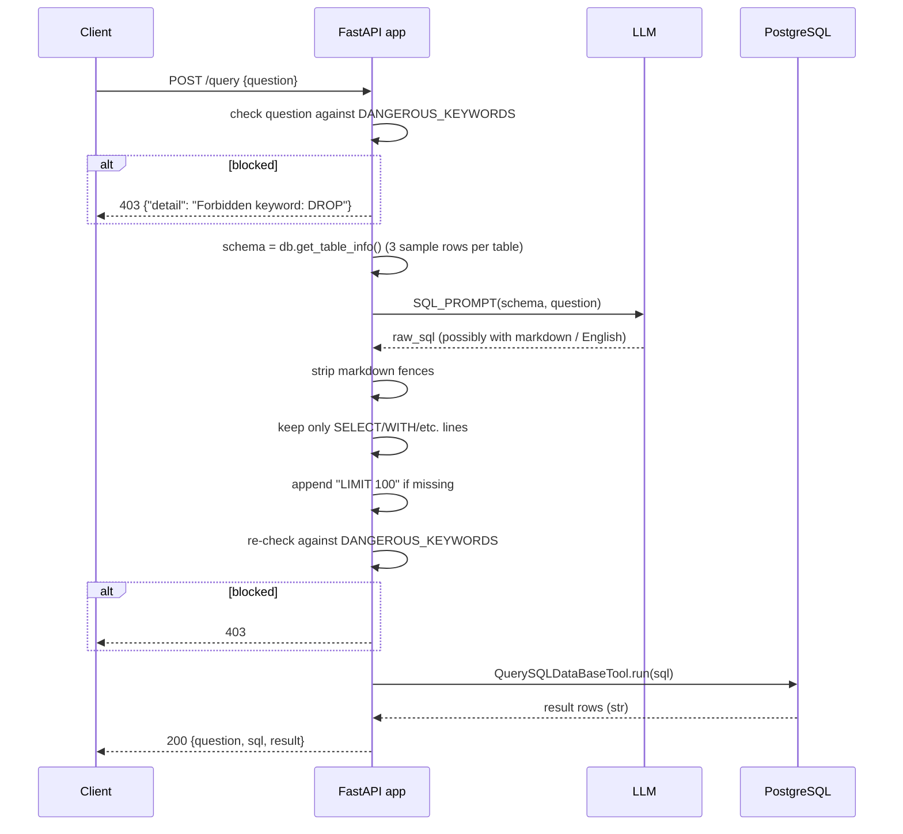

# API_ANALYSIS.md

> Catalog of every HTTP/RPC surface in the platform.

---

## 1. AI Agent (`ai-agent/main.py`) — current implementation

| Method | Path | Body / Query | Returns | Notes |
|---|---|---|---|---|
| GET  | `/`        | — | `{message}` | liveness ping |
| GET  | `/health`  | — | `{status, model, ollama_host, tables[]}` | reports DB connectivity + LLM target |
| GET  | `/schema`  | — | `{schema}` | full DDL string from `db.get_table_info()` |
| POST | `/query`   | `{question: str}` | `{question, sql, result, error?}` | NL→SQL roundtrip |

**Auth**: none.
**Rate limit**: none.
**Request size cap**: FastAPI default (~1 MB).
**Output size cap**: none — full result text in response body.
**CORS**: not configured (FastAPI default = same-origin only).

### Lifecycle of `POST /query`



### Error model

The handler catches all non-`HTTPException` errors and returns a 200 with `error` field populated:
```json
{"question": "...", "sql": "...", "result": "", "error": "psycopg2 error: ..."}
```

This is **wrong for a public API** — clients expect 4xx/5xx for failures. Recommended:
- DB error → 502 Bad Gateway
- LLM timeout → 504 Gateway Timeout
- Malformed SQL → 500 + `error_code` field

---

## 2. CLI (`cli.py`) — outbound HTTP calls

These are **client-side** — the CLI calls these external APIs.

| Target | Endpoint | Method | Purpose |
|---|---|---|---|
| Kafka Connect | `GET /connectors` | GET | wait-for-ready check |
| Kafka Connect | `GET /connectors/{name}` | GET | check existence before re-registering |
| Kafka Connect | `DELETE /connectors/{name}` | DELETE | remove old connector |
| Kafka Connect | `POST /connectors` | POST | register Debezium connector |
| Kafka Connect | `GET /connectors/{name}/status` | GET | report tasks state |
| Kafka Connect | `GET /connectors/{name}/topics` | GET | list active topics |
| Airflow | `POST /api/v1/dags/{dag}/dagRuns` | POST + Basic auth | trigger DAG |
| Airflow | `PATCH /api/v1/dags/{dag}` | PATCH + Basic auth | unpause DAG |
| Airflow | `GET /api/v1/dags/{dag}/dagRuns` | GET + Basic auth | list runs |
| AI Agent | `GET /health` | GET | health check |
| Service health | various | GET | TCP / HTTP probes for `cli.py status` |

The CLI is the **intended primary client** for operators. Customer/staff/owner end-user UI is not yet built.

---

## 3. Kafka Connect REST API (Debezium endpoint)

Exposed at `http://localhost:8083`. Full standard Kafka Connect API — used by the CLI to manage the Debezium connector.

Notable endpoints we exercise:
- `GET /connector-plugins` — list available connectors
- `POST /connectors` — register a new connector
- `GET /connectors/{name}/config` — fetch config
- `PUT /connectors/{name}/config` — update config (in-place)
- `POST /connectors/{name}/restart` — restart
- `POST /connectors/{name}/tasks/{taskId}/restart` — restart a single task

No auth on this endpoint — intra-network only.

---

## 4. NiFi REST API

Exposed at `https://localhost:8443/nifi-api`. Used by `scripts/nifi_setup.py` to programmatically build the warehouse + payment processor groups.

The setup script:
1. `POST /access/token` (form-encoded) → bearer token
2. `GET /flow/process-groups/root` → root PG id
3. `POST /process-groups/{parent}/process-groups` → create child PGs
4. `POST /process-groups/{pg}/processors` → add processors
5. `POST /process-groups/{pg}/connections` → wire processors

NiFi uses HTTPS with a **self-signed cert** in dev — `verify=False` is used in the script (acceptable for dev, must change for production).

---

## 5. Airflow REST API

Exposed at `http://localhost:8080/api/v1`. Standard Airflow 2.x API. The CLI uses Basic auth with `admin:admin123`.

Notable endpoints used:
- `POST /dags/{dag_id}/dagRuns` — trigger
- `GET /dags/{dag_id}/dagRuns` — list runs (with `?order_by=-start_date&limit=N`)
- `PATCH /dags/{dag_id}` — pause/unpause
- `GET /dags/{dag_id}/tasks` — task list
- `GET /dags/{dag_id}/dagRuns/{run_id}/taskInstances` — drill-in

Production: switch from Basic auth to OAuth2/OIDC.

---

## 6. HiveServer2 JDBC

Exposed at `localhost:10000` (Thrift). Standard Hive JDBC URL:
```
jdbc:hive2://localhost:10000/gold
```

The AI agent (when `DATA_SOURCE=hive`) connects through SQLAlchemy's `hive://` dialect (requires `PyHive[hive]` + `thrift` + `thrift_sasl` — currently NOT in `ai-agent/requirements.txt`; must be added when Hive backend is enabled).

No auth, no SASL — wide open on the local network.

---

## 7. PostgreSQL Wire Protocol

Exposed at `localhost:5433`. Used by:
- AI agent (libpq via psycopg2 → SQLAlchemy)
- Simulators (libpq via psycopg2)
- Airflow scheduler (libpq via SQLAlchemy)
- migrate.py (libpq via psycopg2)
- Debezium (libpq via JDBC + logical replication)

Single role `postgres` with superuser. **All clients share this role** — no separation of duty.

---

## 8. HDFS Web HDFS / Namenode RPC

- `http://localhost:9870/` — NN web UI (browse files)
- `localhost:9000` — HDFS RPC (used by Spark, Hive)

No auth — Hadoop simple security only.

---

## 9. Spark Master Web UI

- `http://localhost:8090/` — submitted apps, workers, executors
- `localhost:7077` — Spark master RPC for `SparkSubmitOperator`

---

## 10. Internal vs Public

| API | Internal-only? |
|---|---|
| AI Agent `/query` | should be **public-facing** with auth — currently neither |
| Kafka Connect REST | internal admin |
| NiFi REST | internal admin |
| Airflow REST | internal admin |
| HiveServer2 JDBC | internal — analytics-only |
| PostgreSQL | internal — operational |

Production deployment should:
- Place AI Agent behind an API gateway with TLS, auth, rate limit
- Keep all admin APIs on a private network (VPC-internal load balancer / VPN-only)

---

## 11. Streaming / WebSocket / SSE

The current AI Agent has no streaming. Recommended addition: an SSE endpoint for streaming summary tokens:

```python
from sse_starlette.sse import EventSourceResponse

@app.post("/query/stream")
async def query_stream(req):
    async def event_gen():
        for chunk in llm.astream(prompt):  # async streaming
            yield {"event": "token", "data": chunk}
        yield {"event": "done", "data": "OK"}
    return EventSourceResponse(event_gen())
```

This makes the perceived latency **~250ms** (first token) instead of 4-8s.

---

## 12. Middleware / Interceptors

None configured. To add (priority order):
1. **Request ID middleware** — assigns `X-Request-ID` header for tracing
2. **Auth middleware** — bearer token validation
3. **Rate limit middleware** — `slowapi` decorator
4. **Logging middleware** — structured JSON access log
5. **Error mapper** — catch known exceptions, map to proper HTTP codes
6. **CORS middleware** — explicit origin allowlist

---

## 13. Versioning

The AI Agent is at v1 (no `/v1/` prefix in routes). For future evolution:
- Use route prefix `app.include_router(v1_router, prefix="/v1")`
- Maintain backwards compat for at least one minor version
- Document breaking changes in CHANGELOG.md

---

## 14. Pagination

`/query` returns up to `LIMIT 100` rows in a single response. No cursor, no offset. For large result sets:
- Add `?page=2&size=100` query params
- Or return a `result_id` and follow-up endpoint `GET /results/{result_id}?offset=100&limit=100`

For analytical questions this rarely matters — aggregates fit in <100 rows. For "list all customers" type questions, pagination is critical.

---

## 15. OpenAPI Spec

FastAPI auto-generates OpenAPI at `/openapi.json` and Swagger UI at `/docs`. Used as the live contract for any future TypeScript / Java client generation.

---

## 16. Concrete API Test Examples

```bash
# Health
curl -s http://localhost:8000/health | jq

# Schema
curl -s http://localhost:8000/schema | jq -r .schema | head -50

# Query
curl -sX POST http://localhost:8000/query \
  -H "Content-Type: application/json" \
  -d '{"question":"How many customers do we have?"}' | jq

# Trigger Airflow DAG
curl -s -u admin:admin123 -X POST \
  http://localhost:8080/api/v1/dags/medallion_pipeline/dagRuns \
  -H "Content-Type: application/json" \
  -d '{"dag_run_id": "manual_'$(date +%s)'"}' | jq

# Register Debezium
curl -s http://localhost:8083/connectors/erp-postgres-connector/status | jq
```

---

## 17. Required New Endpoints (priority list)

When the AI provider is wired in, these endpoints should ship with the rewrite:

| Method | Path | Body | Purpose |
|---|---|---|---|
| POST | `/v1/clarify` | `{question, role, num_questions}` | clarifying-question generation |
| POST | `/v1/query` | `{question, role, session_id?, context?}` | enriched NL→SQL |
| POST | `/v1/chat` | `{message, role, session_id?}` | multi-turn |
| POST | `/v1/query/stream` | same as query, SSE response | streaming summary |
| GET | `/v1/sessions/{id}` | — | retrieve conversation |
| DELETE | `/v1/sessions/{id}` | — | clear session |
| GET | `/v1/schema/tables` | — | list usable tables for the calling role |
| POST | `/v1/feedback` | `{session_id, rating, comment}` | user feedback for offline tuning |
