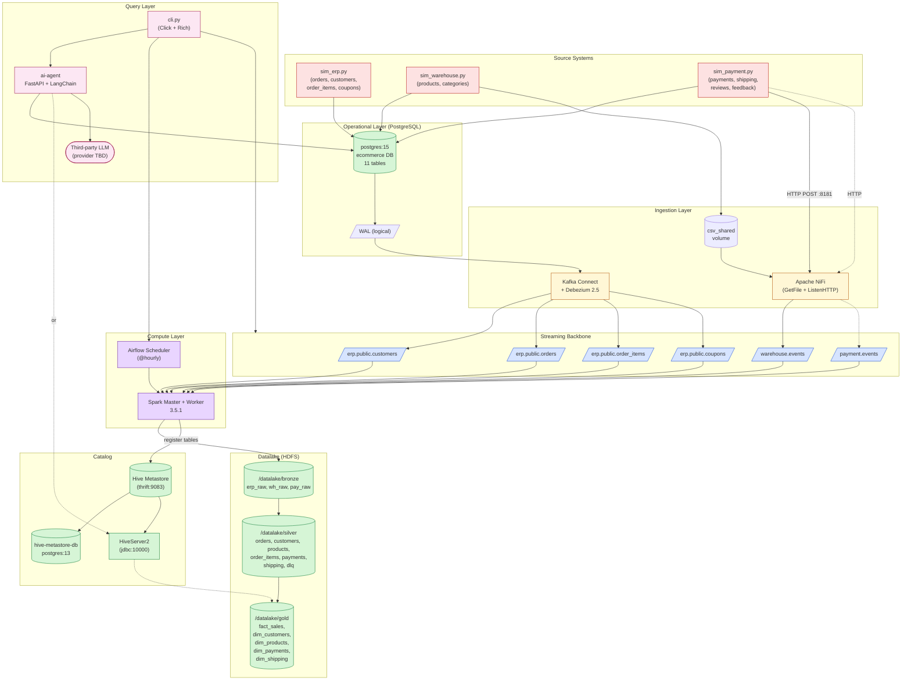
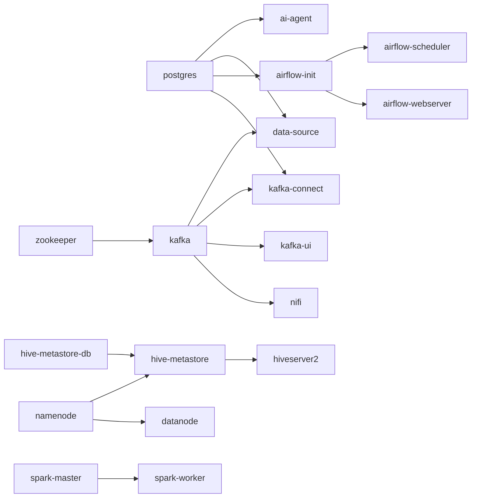

# ARCHITECTURE.md — AI Agent Assistance Platform

> **Audience**: Senior engineers onboarding, architecture review, CTO presentation, production handoff.
> **Last reviewed**: 2026-05-10
> **Status**: Pre-production / graduation project. Functional skeleton, hardening required before production.

---

## 1. Executive Summary

The **AI Agent Assistance** platform is a **hybrid event-driven Big Data system** that bridges raw operational e-commerce data with a **Natural-Language SQL interface** for three classes of users (Business Owner / Staff / Customer).

It implements a textbook **Medallion Lakehouse** (Bronze → Silver → Gold) on top of HDFS, fed by **two parallel ingestion paths** (Debezium CDC + Apache NiFi), processed by **Apache Spark**, orchestrated by **Apache Airflow**, catalogued in **Hive Metastore**, and exposed via a **FastAPI + LangChain** NL→SQL service.

**Architectural style**: hybrid — `event-driven streaming` (Kafka, NiFi) + `batch ETL` (Airflow → Spark) + `request-response` (FastAPI + CLI).

---

## 2. Component Inventory (16 services)

| # | Service | Image / Tech | Role | Port | Interaction |
|---|---|---|---|---|---|
| 1 | `postgres` | postgres:15 | OLTP source-of-truth (ERP) | 5433 | producer (WAL) |
| 2 | `zookeeper` | confluentinc/cp-zookeeper:7.5.0 | Kafka metadata | 2181 | infra |
| 3 | `kafka` | confluentinc/cp-kafka:7.5.0 | Event broker | 9092/29092 | broker |
| 4 | `kafka-ui` | provectuslabs/kafka-ui | Topic monitor | 8888 | observability |
| 5 | `kafka-connect` | debezium/connect:2.5 | CDC runtime | 8083 | producer (CDC→Kafka) |
| 6 | `nifi` | apache/nifi:1.23.2 | Ingestion router | 8443/8181 | producer (CSV/HTTP→Kafka) |
| 7 | `namenode` | bde2020/hadoop-namenode | HDFS metadata | 9870/9000 | storage |
| 8 | `datanode` | bde2020/hadoop-datanode | HDFS blocks | — | storage |
| 9 | `spark-master` | bitnamilegacy/spark:3.5.1 | Cluster manager | 7077/8090 | compute |
| 10 | `spark-worker` | bitnamilegacy/spark:3.5.1 | Executor | — | compute |
| 11 | `hive-metastore-db` | postgres:13 | Hive catalog DB | — | catalog backing-store |
| 12 | `hive-metastore` | bde2020/hive:2.3.2 | Thrift catalog | 9083 | catalog |
| 13 | `hiveserver2` | bde2020/hive:2.3.2 | JDBC/Thrift gateway | 10000/10002 | query gateway |
| 14 | `airflow-init/webserver/scheduler` | apache/airflow:2.8.1 | Orchestrator | 8080 | scheduler |
| 15 | `data-source` | python:3.10-slim | 3 simulators | — | producer |
| 16 | `ai-agent` | python:3.11-slim + FastAPI | NL→SQL service | 8000 | API |

---

## 3. High-level System Diagram

---

## 4. Communication Patterns

### 4.1 Producers vs Consumers vs Orchestrators

| Component | Producer of | Consumer of | Orchestrator? |
|---|---|---|---|
| `sim_erp.py` | rows in PostgreSQL | — | no |
| `sim_warehouse.py` | rows in PG, CSV files in `csv_shared` | — | no |
| `sim_payment.py` | rows in PG, HTTP POST to NiFi | — | no |
| `Debezium Connect` | Kafka messages on `erp.public.*` | PG WAL via logical replication | no |
| `NiFi (warehouse-pipeline)` | `warehouse.events` | files in `csv_shared` | no |
| `NiFi (payment-pipeline)` | `payment.events` | HTTP POSTs on :8181 | no |
| `Spark bronze_ingestion` | Bronze Parquet | 6 Kafka topics | no |
| `Spark silver_transform` | Silver Parquet + DLQ | Bronze Parquet | no |
| `Spark gold_transform` | Gold Parquet + Hive registrations | Silver Parquet | no |
| `Airflow scheduler` | Spark submit calls | DAG file | **YES** |
| `ai-agent` | SQL queries against PG/Hive | LLM completions, schema | no |
| `cli.py` | REST calls to Connect/Airflow/AI | none | no |

### 4.2 Synchronous vs Asynchronous

| Hop | Mode | Mechanism |
|---|---|---|
| Simulator → PG | sync | psycopg2 INSERT/UPDATE |
| PG → Debezium | async | logical decoding (pgoutput plugin, slot `erp_debezium_slot`) |
| Simulator → NiFi (payment) | sync (blocking HTTP) | `requests.post(...)` |
| Simulator → CSV file | sync | file write |
| CSV → NiFi (warehouse) | async (poll-based) | `GetFile` processor |
| NiFi → Kafka | async | `PublishKafkaRecord` |
| Debezium → Kafka | async | Connect framework |
| Kafka → Spark Bronze | **batch** (not streaming) | `spark.read.format("kafka")` with `startingOffsets=earliest`, `endingOffsets=latest` |
| Bronze → Silver → Gold | sequential, batch | `SparkSubmitOperator` chain |
| CLI → AI Agent | sync HTTP | `requests` |
| AI Agent → LLM | sync HTTP | LangChain `llm.invoke()` |
| AI Agent → DB | sync JDBC/SQL | `QuerySQLDataBaseTool` |

> **Important**: `bronze_ingestion.py` is **batch-mode Kafka read**, not Structured Streaming. Each Airflow run reads the full topic (`earliest→latest`) and **overwrites** Bronze partitions. This is intentional for reproducibility but is **not exactly-once streaming** — see `PERFORMANCE_ANALYSIS.md`.

### 4.3 Retry & Failure Handling

| Layer | Mechanism | Source |
|---|---|---|
| Airflow tasks | `retries=1`, `retry_delay=5min` | `airflow/dags/medallion_pipeline.py` |
| Debezium connector | replication slot persists offset; restarts resume | Connect framework |
| Spark reads | `failOnDataLoss=false` on Kafka source | `spark/jobs/bronze_ingestion.py` |
| Silver DLQ | rows failing required-not-null filter routed to `/datalake/silver/dlq` | `spark/jobs/silver_transform.py` |
| Simulator → NiFi | try/except, "log only — không crash" | `sim_payment.py post_to_nifi` |
| AI Agent | try/except returning `error` field; no retry | `ai-agent/main.py` |
| CLI → APIs | no retry layer; first-failure surfaces to user | `cli.py` |

### 4.4 Dependency Graph (start order)

`docker-compose` `depends_on` enforces only liveness, **not readiness**, except for healthchecks on `postgres`, `kafka-connect`, `hive-metastore-db`, `hiveserver2`, `airflow-webserver`, `ai-agent`. Some downstream services (e.g. `nifi`, `spark-master`) depend on `kafka` only with `condition: service_started` — meaning they can race ahead of broker readiness on cold start.

---

## 5. Bounded Contexts / Domain Boundaries

| Bounded Context | Owns | Outbound events | Source-system code |
|---|---|---|---|
| **ERP** | customers, addresses, orders, order_items, coupons | `erp.public.*` Kafka topics | `sim_erp.py` |
| **Warehouse** | categories, products, inventory | CSV files → `warehouse.events` | `sim_warehouse.py` |
| **Payment Gateway** | payments, shipping, reviews, feedback | HTTP POSTs → `payment.events` | `sim_payment.py` |
| **Lakehouse** | Bronze/Silver/Gold Parquet, Hive catalog | Hive table metadata | `spark/jobs/*` |
| **Insight Layer** | NL→SQL translation, role context | HTTP responses | `ai-agent/main.py` |

A deliberate anti-pattern fix is documented in `sim_payment.py`: shipping no longer **directly UPDATEs** `orders.status` — it emits an event, preserving the ERP domain boundary.

---

## 6. Architectural Style — Hybrid Justified

The project mixes three paradigms because each is appropriate for a different concern:

1. **Event-driven streaming** (Kafka + NiFi + Debezium) for **decoupled ingestion** — sources don't know about consumers; new sinks can be added without changing producers.
2. **Batch lakehouse** (Spark Medallion) for **analytical workloads** — Gold layer is a star schema optimized for OLAP joins and aggregations, not OLTP throughput.
3. **Synchronous API** (FastAPI) for **interactive querying** — humans expect <2s responses; the AI layer cannot be event-driven.

This split-pattern is industry-standard but has known trade-offs (data freshness, infra complexity) — see `PERFORMANCE_ANALYSIS.md`.

---

## 7. Strengths & Architectural Risks

### Strengths
- ✓ Clear Medallion separation with **DLQ pattern** for bad data
- ✓ Source envelopes (`_source_system`, `_event_id`, `_op_type`, `_quality_flag`) enable robust dedup and quality routing
- ✓ Surrogate keys (`MD5(source:id)`) prevent ID collisions across sources
- ✓ Hive **EXTERNAL** tables (not managed) — schema lives separately from data, supports re-processing
- ✓ Idempotent writes (`mode("overwrite")`) on Bronze/Silver/Gold
- ✓ CDC + replication-slot pattern is production-grade (not naïve polling)

### Risks
- ✗ Bronze ingestion is **full-rescan batch** — does not scale with event volume
- ✗ NiFi flow is **not in version control** — flow.xml.gz must be exported/imported manually (mitigated by `scripts/nifi_setup.py`)
- ✗ Single-broker Kafka (`replication factor=1`) — broker loss = data loss
- ✗ Single-namenode HDFS — SPOF
- ✗ Airflow uses **LocalExecutor** + SQLite-style metadata in same Postgres as ERP — coupling and contention risk
- ✗ AI agent has no auth, no rate limiting, no input length cap
- ✗ Hardcoded credentials throughout compose file

See `SECURITY_REVIEW.md` and `PERFORMANCE_ANALYSIS.md` for deep analysis.

---

## 8. References

- `docker-compose.yml` — service topology
- `airflow/dags/medallion_pipeline.py` — orchestration
- `spark/jobs/bronze_ingestion.py` — Kafka → Bronze
- `spark/jobs/silver_transform.py` — Bronze → Silver
- `spark/jobs/gold_transform.py` — Silver → Gold star schema
- `data-source/sim_*.py` — source simulators
- `ai-agent/main.py` — NL→SQL service
- `cli.py` — operational CLI
