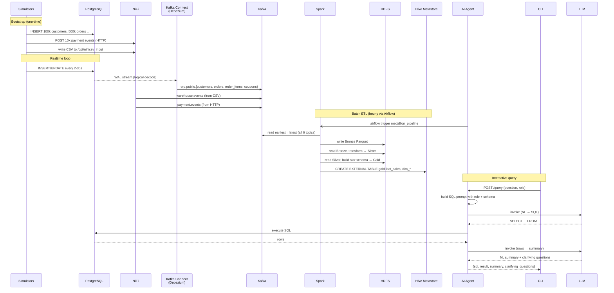

# DATA_FLOW.md — End-to-End Data Pipeline

> Trace of every byte from source generation to NL answer.
> All references are to actual files in the repo.

---

## 1. Three Source Paths

The platform deliberately models **three different ingestion patterns** to mimic real heterogeneous landscapes:

| Source | Domain | Mechanism | NiFi? | CDC? | Why this path |
|---|---|---|---|---|---|
| ERP (`sim_erp.py`) | customers, orders, order_items, coupons | PG WAL → Debezium | no | **yes (logical decoding)** | textbook OLTP-source CDC |
| Warehouse (`sim_warehouse.py`) | categories, products | CSV file drop → NiFi GetFile → Kafka | yes | no | mimics legacy batch dumps |
| Payment Gateway (`sim_payment.py`) | payments, shipping, reviews, feedback | HTTP POST → NiFi ListenHTTP → Kafka | yes | no | mimics SaaS webhooks |

All three converge into Kafka topics and then a single Bronze layer.

---

## 2. Flow Diagram (Sequence)



---

## 3. Detailed Trace per Source

### 3.1 ERP path (CDC)

**File**: `data-source/sim_erp.py` (951 lines)

**Bootstrap phase** (run once): inserts 100k customers, 200k addresses, 100k coupons, 500k orders, ~1.2M order_items into PostgreSQL.

**Realtime loop** (continuous):
- new customer every 30s
- new order every 2-5s (with `INTERVAL_NEW_ORDER` jitter)
- order status update every 10s
- new coupon every 5min
- new review every 60s, feedback every 120s

**Dirty injection** (5%): `null_email`, `invalid_email`, `phone_too_long`, `duplicate_email`, `status_typo`, `future_order_date`, `negative_amount`, `late_cdc_delay`, `missing_items`. Driven by `DIRTY_RATE = 0.05` and `DIRTY_CONFIG` dict.

**CDC capture path**:

```
psycopg2.commit()
   ↓
PostgreSQL WAL (wal_level=logical, max_replication_slots=10)
   ↓
slot 'erp_debezium_slot' (publication 'erp_publication')
   ↓
Debezium PostgresConnector with plugin=pgoutput
   ↓
ExtractNewRecordState SMT (unwraps Debezium envelope, adds __op, __table, __source_ts_ms)
   ↓
Kafka topics:
   erp.public.customers       (one record per row mutation)
   erp.public.orders
   erp.public.order_items
   erp.public.coupons
```

The connector config (in `cli.py debezium setup` and `scripts/register_debezium.sh`):

```json
"snapshot.mode": "initial",
"transforms": "unwrap",
"transforms.unwrap.type": "io.debezium.transforms.ExtractNewRecordState",
"transforms.unwrap.add.fields": "op,table,source.ts_ms",
"transforms.unwrap.delete.handling.mode": "rewrite"
```

**Key implication**: Spark Silver assumes flat JSON with `__op` and `__table` fields. See `silver_transform.py` `parse_erp_topic()`.

---

### 3.2 Warehouse path (CSV → NiFi)

**File**: `data-source/sim_warehouse.py` (587 lines)

**Output**: writes deltas to `csv_shared` Docker volume mounted at `/opt/nifi/csv_input` (NiFi side) and `/app/csv_output` (data-source side).

```
sim_warehouse.py
   ↓ writes file: /app/csv_output/products_delta_{ts}.csv
   ↓ (volume mount)
/opt/nifi/csv_input/  (in NiFi container)
   ↓ NiFi processor: GetFile (poll every 1s)
   ↓ ConvertRecord (CSVReader → JsonRecordSetWriter)
   ↓ PublishKafkaRecord (topic warehouse.events)
   ↓
Kafka: warehouse.events
```

**Envelope** added by simulator before write (flat — no nested payload):
```json
{
  "_source_system": "warehouse",
  "_schema_version": "1.0",
  "_event_id": "<uuid>",
  "_event_type": "products",
  "_ingested_at": "2026-...",
  "_quality_flag": "CLEAN" | "DIRTY",
  "_dirty_reason": "...",
  "category_id": 12,
  "name": "...",
  "sku": "...",
  "price": "...",
  "cost": "...",
  ...
}
```

**Spark Silver** (`silver_transform.py`) decodes this with `WH_SCHEMA` — note all fields are flat at the top level (no `payload` wrapper).

---

### 3.3 Payment path (HTTP webhook → NiFi)

**File**: `data-source/sim_payment.py` (670 lines)

```
sim_payment.py
   ↓ INSERT/UPDATE PostgreSQL
   ↓ requests.post('http://nifi:8181/payment-events', envelope)
   ↓
NiFi ListenHTTP (port 8181, base path 'payment-events')
   ↓ PublishKafkaRecord → payment.events
   ↓
Kafka: payment.events
```

**Envelope** is **nested** (different from warehouse — this is intentional):
```json
{
  "_source_system": "payment_gw",
  "_schema_version": "1.0",
  "_event_id": "<uuid>",
  "_event_type": "payments" | "shipping" | "reviews" | "feedback",
  "_op_type": "c" | "u",
  "_ingested_at": "...",
  "_quality_flag": "CLEAN" | "DIRTY",
  "payload": {
    "id": ...,
    "order_id": ...,
    "payment_method": "...",
    "amount": ...,
    ...
  }
}
```

**Why nested for payment but flat for warehouse?** This deliberately mimics real heterogeneity — the Spark Silver job must handle both shapes. See `silver_transform.py` lines parsing `ENVELOPE_SCHEMA` then `from_json(payload, PAYMENT_SCHEMA)`.

---

## 4. Bronze Layer

**File**: `spark/jobs/bronze_ingestion.py` (~110 lines)

**Logic** (per `ingest_topics()`):
```python
df_raw = spark.read.format("kafka")
   .option("subscribe", "erp.public.customers,erp.public.orders,...")
   .option("startingOffsets", "earliest")
   .option("endingOffsets",   "latest")
   .option("failOnDataLoss",  "false")
```

**Per ingest call, Bronze writes**:
```
hdfs://namenode:9000/datalake/bronze/erp_raw/
hdfs://namenode:9000/datalake/bronze/wh_raw/
hdfs://namenode:9000/datalake/bronze/pay_raw/
```

with columns:
```
raw_data, kafka_key, _source_topic, _kafka_partition,
_kafka_offset, _kafka_timestamp, _bronze_ingested_at
```

**Partitioning**: `partitionBy("_source_topic", "_kafka_partition")`.

**Mode**: `overwrite` — every run rewrites the entire Bronze. This is **idempotent and reproducible** but wastes I/O. For >10M events/day this should be moved to streaming + append.

---

## 5. Silver Layer

**File**: `spark/jobs/silver_transform.py` (~280 lines)

Three branches keyed by `_source_topic`:

### 5.1 ERP branch
- Filters by `_source_topic = erp.public.<table>`
- Parses with strict typed schemas (`ORDER_SCHEMA`, `CUSTOMER_SCHEMA`, `ORDER_ITEM_SCHEMA`)
- **Drops Debezium delete events** (`__op != 'd'`) — Silver is the latest snapshot, not historical changelog
- Cleans:
  - `null_placeholders()` replaces `"UNKNOWN"`, `"N/A"`, `"#N/A"`, `"None"`, `"null"`, `"EMPTY"`, `"--"`, `"???"`, `"TBD"`, `"not available"`, `""` with NULL
  - `normalize_status()` whitelists ENUM values, returns NULL for typos
  - regex email validation `^[^@\s]+@[^@\s]+\.[^@\s]+$`
  - cast strings to `DecimalType(12,2)` and `Timestamp`
  - dedup by primary key

### 5.2 Warehouse branch
- Parses **flat** `WH_SCHEMA`
- SKU canonicalization: `regexp_replace(upper(trim(sku)), r"[_\s]", "-")`
- Dedup by `_event_id` (idempotent against retried events)
- Cleans price (positive only)

### 5.3 Payment branch
- Parses **two-layer**: `ENVELOPE_SCHEMA` then `from_json(payload, PAYMENT_SCHEMA | SHIPPING_SCHEMA)`
- Dedup by `_event_id` then by `transaction_id` / `tracking_number`
- Whitelist payment methods, statuses

### 5.4 DLQ Pattern
Every entity has `drop_dirty()` returning `(clean, dirty)`. Dirty rows go to:

```
hdfs://.../datalake/silver/dlq/   (mode=append)
```

with columns `id, _quality_flag, _bronze_ingested_at`. This is a **production-grade DLQ pattern** but the union over heterogeneous schemas (using only common columns) loses detail; reviewers must go back to Bronze for full context.

---

## 6. Gold Layer

**File**: `spark/jobs/gold_transform.py` (~170 lines)

**Star schema**:
```
fact_sales       (grain = one order_item)
   ├── dim_customers   (customer_key)
   ├── dim_products    (product_key)
   ├── dim_payments    (payment_key)
   └── dim_shipping    (shipping_key)
```

`fact_sales` is partitioned by `(order_year, order_month)` for partition pruning on date filters.

**Hive registration** (note the `EXTERNAL` table — schema and data are decoupled):
```sql
DROP TABLE IF EXISTS gold.fact_sales;
CREATE EXTERNAL TABLE gold.fact_sales
USING parquet
LOCATION 'hdfs://.../datalake/gold/fact_sales'
PARTITIONED BY (order_year, order_month);
MSCK REPAIR TABLE gold.fact_sales;
```

The AI agent (when configured for Hive) reads through `hiveserver2:10000` (JDBC).

---

## 7. Topic / Partition / Consumer Inventory

| Topic | Partitions (default 1) | Producer | Consumers | Schema |
|---|---|---|---|---|
| `erp.public.customers` | 1 | Debezium | Spark Bronze | flat JSON + `__op,__table,__source_ts_ms` |
| `erp.public.orders` | 1 | Debezium | Spark Bronze | flat JSON + `__op,__table,__source_ts_ms` |
| `erp.public.order_items` | 1 | Debezium | Spark Bronze | flat JSON + `__op,__table,__source_ts_ms` |
| `erp.public.coupons` | 1 | Debezium | Spark Bronze | flat JSON + `__op,__table,__source_ts_ms` |
| `warehouse.events` | 1 | NiFi | Spark Bronze | flat JSON envelope |
| `payment.events` | 1 | NiFi | Spark Bronze | nested envelope `payload: {...}` |

> **Production gap**: 1 partition per topic = no parallelism. Increase to ≥3 for any production workload.

---

## 8. Consumer Group / Offset Tracking

The Spark Bronze job is **batch read** (not Structured Streaming) and does **not commit offsets** to Kafka. Each Airflow run reads from `earliest` to `latest`. Consequences:

- **Pro**: deterministic, easy to reason about
- **Pro**: re-runnable without state corruption
- **Con**: at scale (>1M events) wasteful — every run reprocesses everything before overwriting Bronze
- **Con**: cannot leverage Kafka consumer group lag monitoring meaningfully

---

## 9. Late-Arrival & Race Conditions

The simulators **deliberately inject** these:

- `sim_payment.py` posts to NiFi **before** committing to PG (race) → payment may reference an order Spark hasn't seen yet
- `sim_payment.py` injects `mismatched_order_ref` (5% rate, fake order_id 9_000_000+)
- `sim_erp.py` injects `late_cdc_delay` — sleeps 1-3s before commit so Payment can arrive first

**Spark Silver handling**: dropping orphaned FK references is **NOT** done in Silver — `gold_transform.py` uses `LEFT JOIN` so orphaned facts get NULL dim keys. This is correct behavior (preserves the row, marks dim as missing) but the data engineer must be aware that NULL `customer_key` in `fact_sales` is **expected**, not a bug.

---

## 10. Data Volume Expectations

From simulator config (`sim_erp.py` defaults):
- 100k customers (bootstrap)
- 500k orders × ~2.4 items/order ≈ 1.2M order_items
- realtime: ~30 orders/min steady-state

From `documentations/CHI_TIET_LOI_DU_LIEU.md` (dirty CSV practice set):
- 11 tables, ~71k clean rows → ~77k dirty rows
- ~3.6k exact duplicates, ~1.4k near-duplicates, ~1.3k orphaned FK references

These are **practice scales** — the platform is dimensioned for graduation-project, not production traffic.

---

## 11. End-to-end Latency Budget

| Hop | Expected latency |
|---|---|
| Sim → PG | <100ms |
| PG WAL → Kafka | typically <1s |
| Sim → NiFi → Kafka | <500ms |
| Kafka → Bronze (per Airflow tick) | hourly (`schedule_interval="@hourly"`) |
| Bronze → Silver | sequential (~minutes for practice volumes) |
| Silver → Gold | sequential (~minutes) |
| AI Agent → SQL → answer | dominated by LLM (1–8s) |

**Total source-to-answer**: bounded by Airflow cadence — currently **up to 1 hour stale** at the Gold layer. To get fresher answers the AI agent currently queries PostgreSQL directly (configurable via `DATA_SOURCE` env var).
