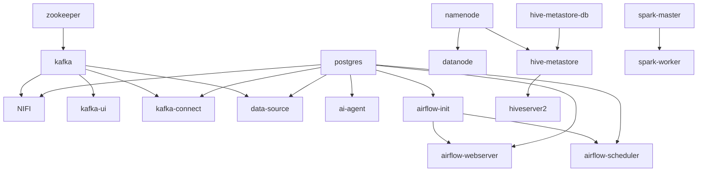

# INFRASTRUCTURE.md — Docker, Networking, Deployment

> **Source of truth**: `docker-compose.yml` (16 services), `Makefile`, `cli.py`, `scripts/*.sh`.

---

## 1. Container Inventory & Resource Footprint

| Container | Image | Approx RAM (idle) | Persistent volume |
|---|---|---|---|
| postgres | postgres:15 | ~80 MB | bind: `./data/postgres` |
| zookeeper | confluentinc/cp-zookeeper:7.5.0 | ~250 MB | bind: `./data/zookeeper/{data,log}` |
| kafka | confluentinc/cp-kafka:7.5.0 | ~700 MB JVM | bind: `./data/kafka` |
| kafka-ui | provectuslabs/kafka-ui | ~150 MB | none |
| nifi | apache/nifi:1.23.2 | ~1.2 GB JVM | bind: `./nifi/*`, `csv_shared` named vol |
| namenode | bde2020/hadoop-namenode:2.0.0 | ~500 MB JVM | bind: `./hdfs/namenode` |
| datanode | bde2020/hadoop-datanode:2.0.0 | ~400 MB JVM | bind: `./hdfs/datanode` |
| spark-master | bitnamilegacy/spark:3.5.1 | ~600 MB JVM | bind: `./spark/jobs`, `./spark/conf/...` |
| spark-worker | bitnamilegacy/spark:3.5.1 | ~2 GB (`SPARK_WORKER_MEMORY=2G`) | same |
| kafka-connect | debezium/connect:2.5 | ~600 MB JVM | none |
| hive-metastore-db | postgres:13 | ~80 MB | named vol `hive_metastore_db` |
| hive-metastore | bde2020/hive:2.3.2 | ~500 MB JVM | none (uses HDFS for warehouse) |
| hiveserver2 | bde2020/hive:2.3.2 | ~600 MB JVM | none |
| airflow-webserver | apache/airflow:2.8.1 | ~500 MB | bind: `./airflow/dags`, `./spark/jobs`, named `airflow_logs` |
| airflow-scheduler | apache/airflow:2.8.1 | ~400 MB | same |
| airflow-init | apache/airflow:2.8.1 | (transient) | shares Airflow Postgres DB |
| data-source | python:3.10-slim | ~50 MB | bind: `./data-source`, `csv_shared` |
| ai-agent | python:3.11-slim | ~150 MB | none |

**Total memory ceiling at idle**: ~9 GB. With moderate load (Spark job running, NiFi flow active, Airflow scheduler busy): **~12-14 GB**.

> **Practical implication**: a 16 GB laptop is the realistic minimum. Below that, expect OOM kills on Spark workers.

---

## 2. Network Topology

Single Docker bridge network: `dataplatform`.

All inter-service communication uses container hostnames (e.g., `postgres`, `kafka:29092`, `hive-metastore:9083`). External access is via host port mappings:

| Host port → container port | Service |
|---|---|
| 5433 → 5432 | PostgreSQL |
| 9092 → 9092 | Kafka (PLAINTEXT_HOST) |
| 8888 → 8080 | Kafka UI |
| 8443 → 8443 | NiFi (HTTPS UI) |
| 8181 → 8181 | NiFi ListenHTTP (payment ingestion) |
| 9870 → 9870 | HDFS Namenode UI |
| 9000 → 9000 | HDFS RPC |
| 8090 → 8080 | Spark Master UI (8080 conflicts with Airflow) |
| 7077 → 7077 | Spark RPC |
| 8083 → 8083 | Kafka Connect REST |
| 9083 → 9083 | Hive Metastore Thrift |
| 10000 → 10000 | HiveServer2 JDBC/Thrift |
| 10002 → 10002 | HiveServer2 Web UI |
| 8080 → 8080 | Airflow web |
| 8000 → 8000 | AI Agent FastAPI |

**Port conflict already resolved**: Spark UI moved from 8080 → 8090 (host) because Airflow takes 8080, and Kafka UI moved from 8080 → 8888 because NiFi uses ListenHTTP on 8181.

---

## 3. Volume Strategy

| Volume | Type | Why |
|---|---|---|
| `csv_shared` | named | data-source ↔ NiFi handoff (CSV files) |
| `hive_metastore_db` | named | Hive catalog Postgres data |
| `airflow_logs` | named | persists DAG run logs across restarts |
| `./data/postgres` | bind | ERP DB durability + easy host-side inspection |
| `./data/kafka` | bind | broker logs survive restart |
| `./data/zookeeper/*` | bind | ZK metadata durability |
| `./hdfs/{namenode,datanode}` | bind | HDFS data on host disk |
| `./nifi/*` | bind | NiFi flow + content + provenance |
| `./spark/jobs` | bind read-write | live job updates without rebuild |
| `./airflow/dags` | bind | live DAG editing |
| `./data-source` | bind | live simulator updates |
| `./hive/init.sh` | bind read-only | metastore startup script |
| `./spark/conf/hive-site.xml` | bind read-only | Spark Hive integration |

> **Risk**: bind mounts on Windows + Docker Desktop have **major** I/O performance penalties for write-heavy workloads (HDFS, Kafka logs). On Linux this is fine; on Windows consider switching `./data/kafka` and `./hdfs/*` to named volumes.

---

## 4. Healthchecks Defined

```yaml
postgres:           pg_isready -U postgres -d ecommerce
kafka-connect:      curl -sf http://localhost:8083/connectors
hive-metastore-db:  pg_isready -U hive -d metastore
hiveserver2:        bash -c '</dev/tcp/localhost/10000'
airflow-webserver:  curl --fail http://localhost:8080/health
ai-agent:           curl -sf http://localhost:8000/health
```

Services **without** healthchecks (relying on `service_started` only):
- zookeeper, kafka, kafka-ui, nifi, namenode, datanode, spark-master, spark-worker, hive-metastore, data-source, airflow-init, airflow-scheduler

> **Improvement**: add Kafka readiness check (`kafka-broker-api-versions --bootstrap-server localhost:9092`), HDFS ready check (`hdfs dfsadmin -report`), Spark master ready (`curl -sf http://localhost:8080/json/`).

---

## 5. Startup Order & Dependency Graph



Cold-start order observed (~2 minutes total):
1. `postgres`, `zookeeper`, `hive-metastore-db`, `namenode` (parallel, ~30s)
2. `kafka`, `datanode`, `hive-metastore`, `airflow-init` (~30s)
3. `kafka-connect`, `nifi`, `kafka-ui`, `hiveserver2`, `spark-master` (~30s)
4. `spark-worker`, `airflow-webserver`, `airflow-scheduler`, `ai-agent`, `data-source` (~30s)

**Known race**: `kafka-connect` is sometimes ready before `postgres` accepts replication; first connector registration may fail and need a retry. The `cli.py debezium setup` includes a 24-attempt retry loop covering this.

---

## 6. Configuration Strategy

### Environment variables flow

```
.env (local file, git-ignored)
   ↓
docker-compose.yml `env_file: ./.env`
   ↓
container's environment
   ↓
Python `os.getenv("DB_HOST", "localhost")` defaults
```

`.env.example` is committed and documents:
- `POSTGRES_USER/PASSWORD/DB`
- `LLM_PROVIDER` (openai|anthropic|google|groq) — to be chosen
- `LLM_API_KEY` (placeholder)
- `LLM_MODEL`
- `DATA_SOURCE` (postgres|hive)

### Hardcoded credentials (must move to .env)

In `docker-compose.yml`:
- `POSTGRES_PASSWORD: postgres`
- `SINGLE_USER_CREDENTIALS_PASSWORD: adminadminadmin` (NiFi)
- `AIRFLOW__CORE__FERNET_KEY: "Eby8vdM02xNOcqFlqUwJPLlmEtlCDXJ1OUzFT50YnVs="`
- `AIRFLOW__WEBSERVER__SECRET_KEY: "graduation-project-secret"`
- airflow admin password `admin123` (in `airflow-init` command)
- Hive metastore `hive/hive`

These are acceptable for a local graduation project but **must be rotated and externalized** before any deployment.

---

## 7. Build vs Pull

| Service | Built locally | From registry |
|---|---|---|
| postgres, zookeeper, kafka, kafka-ui, nifi, namenode, datanode, spark-*, kafka-connect, hive-metastore-db, hive-metastore, hiveserver2, ollama (removed) | — | ✓ |
| airflow-init, airflow-webserver, airflow-scheduler | ✓ (`./airflow/Dockerfile`) | base from apache/airflow:2.8.1 |
| data-source | ✓ (`./data-source/Dockerfile`) | python:3.10-slim |
| ai-agent | ✓ (`./ai-agent/Dockerfile`) | python:3.11-slim |

The Airflow image is rebuilt to add `apache-airflow-providers-apache-spark==4.7.1` + `pyspark==3.5.1` so `SparkSubmitOperator` works inside the scheduler container.

---

## 8. Deployment Targets

This compose file is **single-host only**. Migration paths:

### To Docker Swarm
- Mostly works; replace bind mounts with named volumes; add `deploy.placement.constraints` for stateful services to a single node
- Single broker / single namenode remain SPOF

### To Kubernetes (recommended for production)
- Postgres → managed RDS / Cloud SQL
- Kafka → Strimzi operator or Confluent Cloud
- Spark → Spark Operator on K8s + S3-backed shuffle
- HDFS → replace with **S3 / GCS** (drop Namenode/Datanode entirely)
- Hive Metastore → standalone Helm chart, RDS-backed
- Airflow → official Helm chart with KubernetesExecutor
- NiFi → 3-node StatefulSet (or replace with Kafka Connect SMT for the simple flows)
- AI agent → Deployment + HPA + Service + Ingress

A K8s migration is non-trivial — the most impactful single change is **HDFS → S3**, which eliminates two SPOFs.

---

## 9. Scaling Bottlenecks

| Layer | Bottleneck | Mitigation |
|---|---|---|
| Kafka | 1 broker, 1 partition/topic | scale to 3 brokers, increase partitions |
| HDFS | 1 namenode, 1 datanode | use HA namenode + 3+ datanodes, or migrate to S3 |
| Spark | 1 worker, 2 cores, 2GB | add more workers; tune `spark.executor.instances` |
| Postgres | shared by ERP + Airflow + Hive metastore-could-be | split: ERP its own, Airflow its own, Metastore its own (Metastore is already isolated ✓) |
| NiFi | single node | 3-node cluster |
| ai-agent | single instance | replicate behind a load balancer; externalize sessions to Redis |
| Hive Metastore | single instance | OK for read-heavy; scale by adding HiveServer2 replicas |

---

## 10. Operational Runbook

### Start cold
```
make step1     # docker compose up -d  (waits 15s)
make step2     # python cli.py status
make step3     # python cli.py hdfs setup
make step4     # python cli.py seed
make step5     # python cli.py debezium setup
make step6     # configure NiFi (manual or scripts/nifi_setup.py)
make step7     # start simulators
make step8     # python cli.py pipeline run
```

### Daily checks
```
python cli.py status
python cli.py debezium status
python cli.py pipeline status
python cli.py kafka topics
python cli.py kafka lag --group <group>
docker compose logs --tail=200 spark-master
```

### Recovery from a stuck Debezium slot
```
docker compose exec postgres psql -U postgres -d ecommerce \
  -c "SELECT slot_name, active, restart_lsn FROM pg_replication_slots;"
# If slot is inactive but holding WAL, drop it then re-register:
docker compose exec postgres psql -U postgres -d ecommerce \
  -c "SELECT pg_drop_replication_slot('erp_debezium_slot');"
python cli.py debezium setup
```

### Hard reset (destroys all data)
```
make clean        # docker compose down -v
rm -rf data/postgres data/kafka data/zookeeper hdfs/ nifi/{logs,*_repository}
make step1
```

---

## 11. CI/CD — Not Configured

There is no `.github/workflows/`, no GitLab CI, no Jenkinsfile. The project is currently **manual-deploy**. Recommended minimal CI:

- **Lint**: ruff + black on Python; hadolint on Dockerfiles; yamllint on compose
- **Smoke test**: spin up compose, wait for healthchecks, run `python cli.py status`, tear down
- **Spark job tests**: extract pure-PySpark logic into testable functions; assert against tiny fixture DataFrames
- **DAG sanity test**: `airflow dags list-import-errors` against the `dags/` folder

---

## 12. Secrets Handling

Currently **none** — all credentials are hardcoded or in a local `.env`. Production minimum:

- `LLM_API_KEY` → cloud secret manager (AWS Secrets Manager, GCP Secret Manager, Vault)
- DB passwords → injected by orchestrator (K8s Secret, ECS task definition secret)
- Airflow connections → Airflow Secret Backend (e.g., AWS Secrets Manager backend)

---

## 13. Monitoring & Logging — Not Configured

No Prometheus, Grafana, ELK, OpenTelemetry. Each service writes stdout/stderr captured by Docker logging driver.

Recommended addition (lightweight):
- `prometheus` + `node-exporter` + `kafka-exporter` + `postgres-exporter` + `cadvisor`
- `grafana` with default Kafka, Postgres, JVM dashboards
- centralized logs via Loki or similar (cheap and good enough for this scale)

---

## 14. Disaster Recovery Posture

| Asset | Backup | RPO | RTO |
|---|---|---|---|
| PostgreSQL ERP data | none configured | ∞ | manual restore from CSVs |
| Kafka topics | none (replication factor=1) | ∞ | reproduce from PG via Debezium snapshot |
| HDFS Bronze/Silver/Gold | none | ∞ | re-run pipeline |
| Hive Metastore | volume-only | ∞ | re-run gold_transform.py to re-register tables |
| Airflow metadata | none | ∞ | DAG runs lost |

For a graduation project this is acceptable. For production:
- pg_dump nightly + WAL archiving to S3
- Increase Kafka replication to 3
- HDFS → S3 (already covered)
- Hive metastore DB → managed Postgres with PITR
