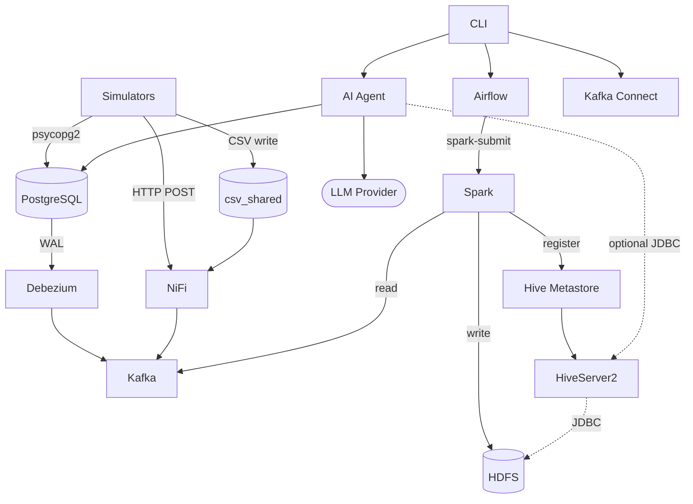
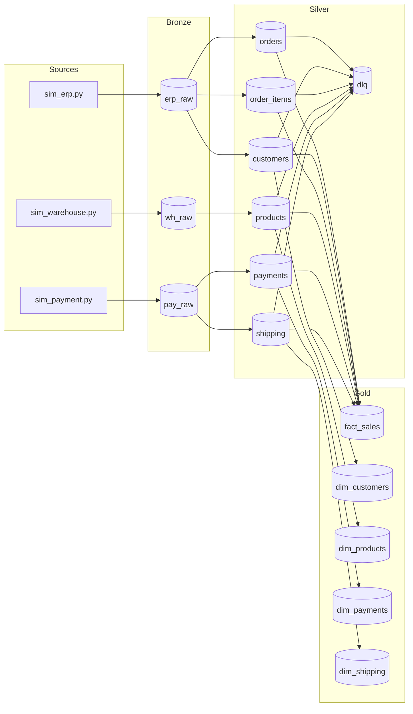
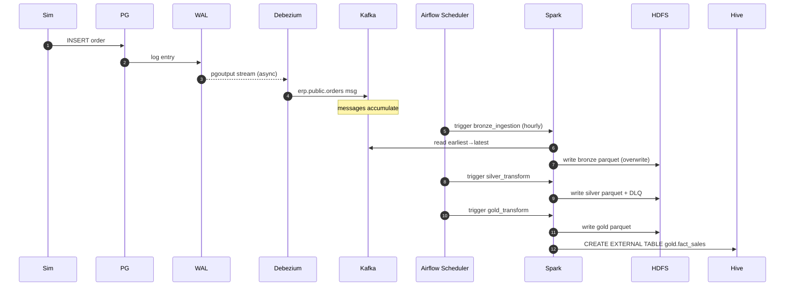
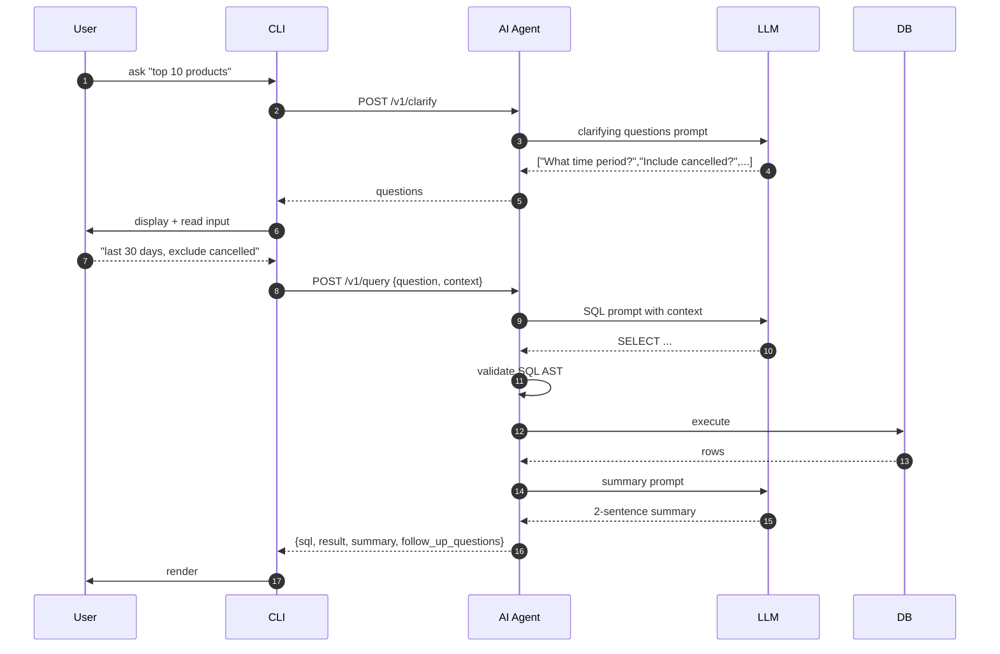
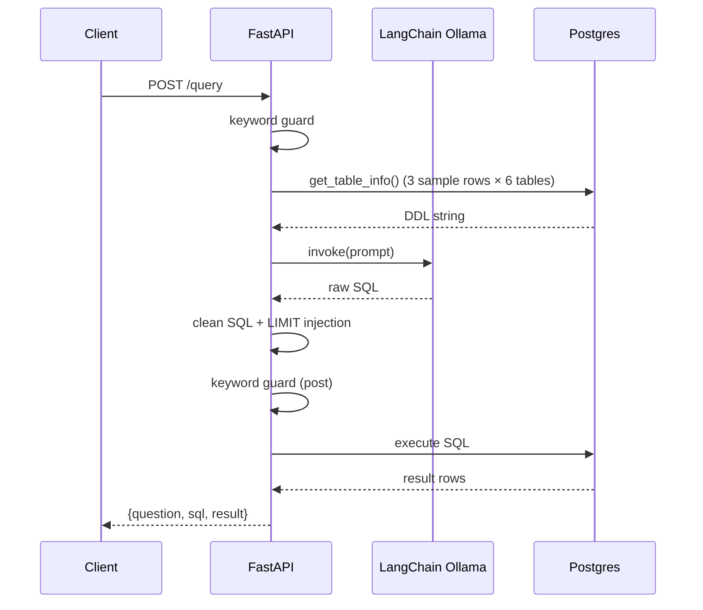

# TECHNICAL REVIEW — AI Agent Assistance Platform

> **Reviewer**: Senior Software Architect / Distributed Systems / AI Platform
> **Date**: 2026-05-10
> **Scope**: full repository — code, infra, data pipelines, AI layer, security, performance.
> **Companion files**: `ARCHITECTURE.md`, `DATA_FLOW.md`, `AI_AGENT_SYSTEM.md`, `INFRASTRUCTURE.md`, `SECURITY_REVIEW.md`, `PERFORMANCE_ANALYSIS.md`, `DATABASE_ANALYSIS.md`, `API_ANALYSIS.md`.

---

## PART 1 — System Overview

### Plain-English summary
A platform that lets a business owner, staff member, or customer ask questions like *"What was last week's revenue by category?"* in plain language and get a precise answer. Behind the scenes it runs a real Big Data pipeline that pulls e-commerce data from three different source systems, cleans it, organizes it for analytics, and exposes it through a small AI service that translates natural language into SQL.

### Technical summary
A **hybrid event-driven Medallion Lakehouse**. Three sources (PostgreSQL via Debezium CDC, CSV via Apache NiFi, HTTP webhooks via NiFi) emit events into Kafka. Apache Spark reads all topics into a Bronze HDFS Parquet layer, applies type/dedup/quality logic to Silver, and materializes a star-schema Gold layer registered in Hive Metastore. Apache Airflow orchestrates the pipeline hourly. A FastAPI service uses LangChain + an LLM provider (TBD) to translate user questions into SQL executed against the operational Postgres or the Hive Gold layer. A Click-based CLI fronts platform operations and (in time) end-user querying.

### Problem solved
- Bridges raw heterogeneous data with non-technical users
- Eliminates the BI bottleneck (everyone can ask anything)
- Provides a substrate for clarifying-question loops to refine vague asks

### Users
- **Business Owner**: strategic KPIs, revenue/profit trends
- **Staff**: order management, shipping status, inventory
- **Customer**: their own orders, products, feedback (with row-level isolation)

### Core features
- Real-time CDC ingestion from OLTP
- Batch + (planned) streaming Spark ETL
- DLQ-based data quality routing
- Star-schema analytical layer with Hive catalog
- NL→SQL via LangChain
- Auto-generated clarifying questions
- Step-by-step DE setup CLI
- Hourly Airflow orchestration

### Architectural style — hybrid

| Pattern | Where |
|---|---|
| Event-driven streaming | Kafka, NiFi, Debezium |
| Batch ETL | Airflow → Spark Medallion |
| Request-response (API) | FastAPI + CLI |
| Microservice-ish | Each container has a single responsibility |

Not a strict microservice architecture (services share the same Postgres / Kafka / HDFS), but the boundaries between source systems are clearly modeled.

---

## PART 2 — Architecture (deep)

See `ARCHITECTURE.md` for the full diagram and dependency graph.

### Communication summary

| Hop | Mode | Protocol |
|---|---|---|
| Sim → PG | sync | psycopg2 |
| PG → Debezium | async | logical replication (pgoutput) |
| Sim → NiFi | sync HTTP | requests.post |
| NiFi → Kafka | async | Kafka producer |
| Debezium → Kafka | async | Connect framework |
| Kafka → Spark Bronze | **batch** | spark.read.kafka (earliest→latest) |
| Bronze → Silver → Gold | sequential batch | SparkSubmitOperator chain |
| AI Agent → LLM | sync HTTP | LangChain |
| AI Agent → DB | sync | SQLAlchemy + JDBC/psycopg2 |
| CLI → APIs | sync | requests |

### Producers / Consumers / Orchestrators

- **Producers**: 3 simulators, Debezium, NiFi, Spark (writes Bronze/Silver/Gold)
- **Consumers**: Spark (reads Kafka), AI agent (reads Postgres / Hive)
- **Orchestrator**: Airflow (the only one)

### Failure handling

- Airflow: 1 retry, 5min delay
- Debezium: durable replication slot resumes after restart
- Spark: `failOnDataLoss=false` on Kafka source
- Silver: DLQ for bad rows
- AI Agent: try/except returns `error` field (no retry)

---

## PART 3 — Data Flow (executive trace)

See `DATA_FLOW.md` for the per-source breakdown. Key facts:

- **Three different envelope shapes** (intentional — mimics real heterogeneity):
  - ERP: flat JSON + `__op,__table,__source_ts_ms`
  - Warehouse: flat JSON + envelope fields at top level
  - Payment: nested JSON with `payload: {...}`
- **Six Kafka topics**, all with **1 partition** in current setup
- **Bronze** is a **batch full-rescan** (not streaming) — will not scale past graduation volumes
- **Silver** filters Debezium DELETEs (snapshot-style, not changelog)
- **Gold** is a 5-way LEFT JOIN star schema with year/month partition
- **DLQ** at `/datalake/silver/dlq` — but loses the original payload (a known weakness)

### End-to-end latency
1 hour stale at Gold (Airflow `@hourly`). For fresher answers, AI agent currently bypasses Gold and queries Postgres directly (`DATA_SOURCE=postgres`).

---

## PART 4 — Tooling & Agent System

See `AI_AGENT_SYSTEM.md` for full details.

**Today the AI is a prompt chain, not an agent**: prompt → LLM → SQL → execute → return.

There is **no tool calling, no ReAct, no self-correction**. Adding these is the natural next step once the LLM provider is chosen.

The **clarifying question generator** is designed as a separate `/clarify` endpoint that runs a dedicated prompt asking for 4 JSON-array questions covering time period / scope / metrics / filters / comparison — designed but not yet in `main.py`.

**Memory**: stateless today. Designed in-memory `sessions` dict (planned), should be Redis in production.

**Vector DB / RAG**: not present. Schema fits in-prompt so unnecessary. Becomes useful only if business glossary or vector product search is added.

---

## PART 5 — Database (summary)

See `DATABASE_ANALYSIS.md` for ERD + indexing recommendations.

- 4 logical databases: ERP, Airflow, Hive metastore, Hive Gold
- ERP schema: 11 tables, comprehensive FK + CHECK constraints
- **Critical gap**: no indexes on FK columns
- Star schema: `fact_sales` (order_item grain) + 4 dims, partitioned by `(order_year, order_month)`
- Hive uses EXTERNAL tables (safe `DROP TABLE`)

---

## PART 6 — APIs (summary)

See `API_ANALYSIS.md`.

- 4 endpoints today on AI Agent: `/`, `/health`, `/schema`, `/query`
- 6 admin/observability APIs surfaced (Connect, NiFi, Airflow, Hive, Postgres, HDFS)
- **No auth, no rate limit, no CORS policy** on AI Agent — must add before exposure

---

## PART 7 — Infrastructure (summary)

See `INFRASTRUCTURE.md`.

- 16 containers, single host, single Docker bridge network
- ~12-14 GB RAM at moderate load → 16 GB laptop is the practical minimum
- All services have host-port bindings — **bind to 127.0.0.1** for shared environments
- Healthchecks on 6 services; the rest rely on liveness only
- No CI/CD configured — opportunity to add lint + smoke test

---

## PART 8 — Performance (summary)

See `PERFORMANCE_ANALYSIS.md`.

Top 5 bottlenecks (urgent to address before scale-up):
1. Bronze full-rescan batch instead of streaming
2. 1-partition Kafka topics
3. Spark worker too small (2 cores / 2 GB)
4. 5-way join in Gold without `broadcast()` hint
5. Missing FK indexes in PostgreSQL

---

## PART 9 — Security (summary)

See `SECURITY_REVIEW.md`. **3 CRITICAL findings**:

1. **No auth on AI Agent** — anyone with network access can issue queries
2. **SQL keyword filter is bypassable** — substring match, no AST parsing
3. **Customer role has no row-level filter** — model can leak other customers' data

Plus 4 HIGH and 8 MEDIUM-LOW findings.

---

## PART 10 — AI/LLM Architecture

**Current**: LangChain `Ollama(model="llama3.2", temperature=0)`. Single LLM call per question. No memory, no streaming.

**Planned**: 3-call flow (clarify → SQL → summary), with role-aware prompts and follow-up question auto-generation.

**Provider TBD** — `.env.example` parameterizes via `LLM_PROVIDER` ∈ {openai, anthropic, google, groq}. Each has different cost/latency/context-window characteristics tabulated in `AI_AGENT_SYSTEM.md` §9.

**Hallucination prevention**: schema-grounded, `temperature=0`, regex output filters. **Gap**: no SQL AST validation, no `EXPLAIN`-cost gate.

---

## PART 11 — Project Structure

```
ai-agent-assistance/
├── ai-agent/                     # NL→SQL FastAPI service
│   ├── Dockerfile                # python:3.11-slim + uvicorn
│   ├── main.py                   # FastAPI app — current 90-line stub
│   └── requirements.txt          # fastapi + langchain
│
├── airflow/                      # Pipeline orchestrator
│   ├── Dockerfile                # apache/airflow:2.8.1 + Spark provider
│   ├── requirements.txt          # provider + pyspark
│   └── dags/
│       └── medallion_pipeline.py # Bronze→Silver→Gold @hourly
│
├── data/                         # Schema + initial data
│   ├── initial_table.sql         # 11-table schema
│   ├── migrate.py                # CSV → PG bulk loader (a.k.a. initial_load.py)
│   ├── csv/                      # 11 cleaned CSV files
│   ├── json/                     # 11 cleaned JSON files
│   ├── dirty_data_complete.zip   # practice dirty dataset
│   ├── HUONG_DAN_LAM_SACH_SPARK.md  # Vietnamese Spark cleaning guide
│   └── postgres-init/
│       ├── 02_list_tables.sql    # post-init verification
│       └── 03_airflow_db.sh      # creates 'airflow' DB
│
├── data-source/                  # Three simulators
│   ├── Dockerfile                # python:3.10-slim
│   ├── requirements.txt          # faker + psycopg2 + requests
│   ├── sim_erp.py                # 951 lines — orders / customers / etc.
│   ├── sim_warehouse.py          # 587 lines — products / categories via CSV
│   ├── sim_payment.py            # 670 lines — payments / shipping via HTTP
│   └── spark_harmonization.py    # 813 lines — runnable Python explanation of Spark Silver concepts (study aid)
│
├── spark/                        # ETL jobs
│   ├── conf/hive-site.xml        # Hive metastore endpoint
│   └── jobs/
│       ├── bronze_ingestion.py   # Kafka → Bronze (batch)
│       ├── silver_transform.py   # Bronze → typed/dedup → Silver + DLQ
│       └── gold_transform.py     # Silver → star schema → Hive
│
├── hive/
│   └── init.sh                   # schematool init then exec metastore
│
├── scripts/                      # Operational scripts
│   ├── register_debezium.sh      # POST connector to Connect REST
│   ├── setup_hdfs.sh             # mkdir Bronze/Silver/Gold dirs
│   ├── seed_data.sh              # check + run migrate.py
│   └── nifi_setup.py             # build warehouse + payment processor groups via REST
│
├── documentations/               # Project docs (this folder)
│   ├── CHI_TIET_LOI_DU_LIEU.md   # detail of injected dirty data
│   ├── ARCHITECTURE.md           # ← part of this review
│   ├── DATA_FLOW.md
│   ├── AI_AGENT_SYSTEM.md
│   ├── INFRASTRUCTURE.md
│   ├── SECURITY_REVIEW.md
│   ├── PERFORMANCE_ANALYSIS.md
│   ├── DATABASE_ANALYSIS.md
│   ├── API_ANALYSIS.md
│   └── TECHNICAL_REVIEW.md       # ← this file
│
├── docker-compose.yml            # 16 services
├── Makefile                      # step1..step10 + utilities
├── cli.py                        # Click + Rich operations CLI
├── cli-requirements.txt          # click + rich + requests
├── .env.example                  # POSTGRES_*, LLM_*, DATA_SOURCE
├── .gitignore                    # Python + project-specific
└── readme.md                     # minimal — TODO: replace with full setup guide
```

### Project entrypoints

| Concern | Entrypoint |
|---|---|
| End-to-end setup | `Makefile` (`make help`) |
| Operations CLI | `cli.py` (`python cli.py guide`) |
| Container start | `docker compose up -d` |
| Pipeline trigger | `airflow/dags/medallion_pipeline.py` via Airflow |
| Spark jobs | `spark/jobs/*.py` (called by Airflow) |
| AI service | `ai-agent/main.py` (`uvicorn main:app`) |

---

## PART 12 — Execution Flow

### Cold-start sequence

```
1. operator runs: make step1   → docker compose up -d
2. parallel: postgres, zookeeper, namenode, hive-metastore-db start (~30s)
   - postgres init script applies initial_table.sql
   - postgres init script creates airflow DB
3. kafka, datanode, hive-metastore, airflow-init come up (~30s)
   - airflow-init runs db upgrade + creates admin user, then exits
4. kafka-connect, nifi, kafka-ui, hiveserver2, spark-master come up (~30s)
5. spark-worker, airflow-webserver, airflow-scheduler, ai-agent, data-source come up (~30s)

6. operator runs: make step3   → python cli.py hdfs setup   (creates /datalake/{bronze,silver,gold})
7. operator runs: make step4   → python cli.py seed         (migrate.py loads CSV → PG)
8. operator runs: make step5   → python cli.py debezium setup  (registers PG CDC connector)
9. operator runs: make step6   → python scripts/nifi_setup.py  (creates warehouse + payment processor groups)
10. operator runs: make step7  → starts the 3 simulators
11. operator runs: make step8  → triggers medallion_pipeline DAG
    - SparkSubmitOperator runs bronze_ingestion.py
    - then silver_transform.py
    - then gold_transform.py (registers Hive tables)
```

### Per-request execution (AI Agent)

```
1. uvicorn worker accepts POST /query
2. read question from JSON body
3. check question against DANGEROUS_KEYWORDS (substring)
4. call db.get_table_info()  →  serializes DDL + 3 sample rows for 6 tables
5. format SQL_PROMPT
6. llm.invoke(prompt)         →  blocks ~1-3s
7. clean SQL (markdown strip, line filter, LIMIT injection)
8. re-check SQL for keywords
9. QuerySQLDataBaseTool.run(sql)  →  blocks 50-500ms
10. return JSON
```

The whole thing runs in a single asyncio task, blocking on sync DB call. **Concurrency**: limited by uvicorn workers (default 1).

---

## PART 13 — Observability

**Currently minimal**: docker logs, Spark UI, Airflow UI, NiFi UI, Kafka UI. No structured logging, no Prometheus, no OpenTelemetry, no LLM-call audit log.

**Recommended additions** (priority order):
1. Structured JSON logs in AI Agent (`logging.config.dictConfig` + JsonFormatter)
2. Per-request log: `request_id, role, question, sql_generated, sql_executed, rows_returned, llm_tokens, latency_ms`
3. Persist 10% of `(question, sql, summary)` to `query_audit` table for offline review
4. Prometheus metrics: `llm_tokens_total{model}`, `sql_query_duration_seconds{role}`, `ai_agent_errors_total{kind}`
5. Grafana dashboard with the standard Kafka + Postgres + JVM dashboards

---

## PART 14 — Diagrams

### Service interaction


### Data flow


### Async event flow


### AI tool calling (planned, future)


### Request lifecycle (today's `/query`)


---

## PART 15 — Final Technical Assessment

### Strengths
- Clear Medallion separation
- Source envelopes + surrogate keys + DLQ pattern (production-grade idioms)
- Step-by-step CLI scaffold makes onboarding fast
- Hive EXTERNAL tables enable safe re-processing
- Idempotent overwrite semantics on Bronze/Silver/Gold
- Realistic dirty-data injection (6 categories) for cleaning practice
- Reasonable container boundaries — each service has a single responsibility

### Weaknesses / technical debt
- Bronze ingestion is full-rescan batch — does not scale
- 1-partition Kafka topics — no parallel consumer
- Single namenode, single broker, single Spark worker — multiple SPOFs
- AI Agent has no auth, no rate limit, no AST parsing on SQL
- LangChain pinned to old version (0.1.0) with known issues
- Hardcoded credentials in `docker-compose.yml`
- No CI/CD, no automated tests
- NiFi flow lives in NiFi state, not in version control (mitigated by `nifi_setup.py`)
- AI Agent uses sync DB calls inside async handler (event-loop blocking)
- No structured logging, no metrics, no tracing
- DLQ schema discards raw payload — limits triage ability
- Customer-role data isolation not enforced (would require RLS or SQL rewrite)
- No FK indexes in PostgreSQL — joins will scale poorly
- No SCD on `dim_customers` — history loss

### Scores (1-10)

| Dimension | Score | Notes |
|---|---|---|
| **Maintainability** | 6 | Code is readable, structured, well-commented (mostly Vietnamese), but no tests + brittle hand-coded schemas in Spark |
| **Scalability** | 4 | Multiple SPOFs, batch full-rescan, single-partition topics |
| **Security** | 3 | No auth on AI Agent, hardcoded creds, no RLS, bypassable SQL filter |
| **Production readiness** | 4 | Acceptable for graduation project demo; major hardening required for real users |
| **Developer experience** | 7 | CLI + Makefile + step-by-step guide is genuinely good |
| **Architecture quality** | 7 | Pattern choice is correct; execution has gaps |

### Top 10 improvements (priority order)

1. **Add API key auth + rate limit + CORS** to AI Agent (security blocker)
2. **Switch AI Agent to a read-only Postgres role** with `SELECT` only on whitelisted tables
3. **Replace substring SQL filter** with a real AST parser (`sqlparse`) and reject multi-statement / non-SELECT
4. **Move Bronze to Spark Structured Streaming** with checkpointing
5. **Add FK indexes** in `initial_table.sql` (~17 indexes)
6. **Broadcast small dims** in `gold_transform.py`
7. **Increase Kafka partitions** to ≥3 per topic and producers must include keys for ordering guarantees
8. **Externalize all credentials** to `.env`; rotate Airflow Fernet key
9. **Replace in-memory sessions with Redis**, externalize SQL audit log to Postgres
10. **Wire CI/CD** — GitHub Actions for lint + smoke test + Spark unit tests

### Top 10 risks

1. AI Agent leaks any-customer data to a single customer (no RLS) — **business-critical**
2. Bypassable SQL filter could allow data exfiltration via `UNION + pg_read_file` — **security-critical**
3. Hardcoded Fernet key compromises all stored Airflow connections — **security-critical**
4. Single Kafka broker — broker loss = data loss (Bronze can be re-derived; CDC offset cannot)
5. Single namenode — restart loses HDFS metadata if `./hdfs/namenode` is on ephemeral storage
6. NiFi flow state not version-controlled — drift risk
7. LangChain 0.1.0 pin is old — security and bug fixes unaddressed
8. Spark worker too small for non-trivial volumes — OOM risk
9. Postgres replication slot may bloat WAL if Connect is offline → disk fill
10. No backups configured for any database

### Refactoring priorities

1. Split AI Agent into `prompts/`, `tools/`, `routes/`, `db/` modules — currently a single 90-line file
2. Extract Spark job common code (helpers, schemas) into `spark/jobs/_lib.py`
3. Move Spark schemas to a versioned schema registry (Avro / Confluent SR)
4. Convert simulators to long-running services with structured logging + Prometheus exporters
5. Replace per-Airflow-run rebuild of Spark images by mounting venv (already done) but ensure Spark provider version aligns with cluster Spark version
6. Convert `cli.py` from monolithic file to a `cli/` package with subcommands per file

---

## Appendix — File-Reference Map

| Concern | File |
|---|---|
| Compose | `docker-compose.yml` |
| DAG | `airflow/dags/medallion_pipeline.py` |
| Bronze | `spark/jobs/bronze_ingestion.py` |
| Silver | `spark/jobs/silver_transform.py` |
| Gold | `spark/jobs/gold_transform.py` |
| AI Agent | `ai-agent/main.py` |
| CLI | `cli.py` |
| Makefile | `Makefile` |
| Schema | `data/initial_table.sql` |
| Sims | `data-source/sim_*.py` |
| Hive init | `hive/init.sh` |
| Hive Spark conf | `spark/conf/hive-site.xml` |
| Debezium register | `cli.py debezium setup` and `scripts/register_debezium.sh` |
| HDFS init | `cli.py hdfs setup` and `scripts/setup_hdfs.sh` |
| NiFi init | `scripts/nifi_setup.py` |
