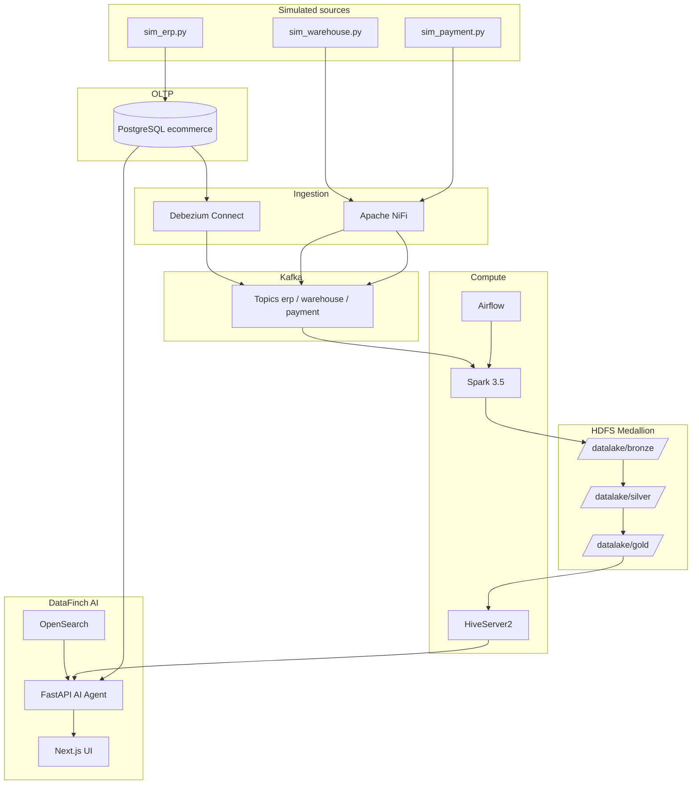

# DataFinch — AI Agent Assistance Platform

An end-to-end **Big Data + AI** platform that simulates an e-commerce data stack: multi-source ingestion (CDC + NiFi), a Medallion lakehouse on HDFS, Airflow/Spark orchestration, and a **natural-language-to-SQL assistant** (DataFinch) for business users.

Graduation / production-like demo project — runs entirely on local Docker Compose.

---

## Table of Contents

- [Overview](#overview)
- [Architecture](#architecture)
- [Technology Stack](#technology-stack)
- [System Requirements](#system-requirements)
- [Repository Structure](#repository-structure)
- [Quick Start](#quick-start)
- [Environment Configuration](#environment-configuration)
- [Services & URLs](#services--urls)
- [Data Pipeline](#data-pipeline)
- [AI Agent & Frontend](#ai-agent--frontend)
- [CLI & Makefile](#cli--makefile)
- [Day-to-Day Operations](#day-to-day-operations)
- [Troubleshooting](#troubleshooting)
- [Further Documentation](#further-documentation)

---

## Overview

The system has **two main layers**:

| Layer | Description |
|-------|-------------|
| **Data Engineering** | PostgreSQL (ERP) → Kafka (Debezium CDC + NiFi) → Spark Bronze/Silver/Gold on HDFS → Hive catalog |
| **AI Layer (DataFinch)** | OpenSearch semantic layer + FastAPI multi-agent → Hive Gold / Postgres Bronze → Next.js UI |

**Three simulated data sources** (`data-source/`):

| Simulator | Mechanism | Kafka topics |
|-----------|-----------|--------------|
| `sim_erp.py` | Writes to OLTP Postgres → Debezium CDC | `erp.public.*` (9 tables) |
| `sim_warehouse.py` | CSV → NiFi GetFile | `warehouse.events` (+ `.dlq`) |
| `sim_payment.py` | HTTP webhook → NiFi ListenHTTP | `payment.events` (+ `.dlq`) |

Simulators inject ~5% controlled dirty data to validate Silver transforms and the DLQ.

---

## Architecture



**Gold star schema** (primary query layer): `fact_sales`, `fact_reviews`, `fact_feedback`, `dim_customers`, `dim_products`, `dim_categories`, `dim_addresses`, `dim_coupons`, `dim_payments`, `dim_shipping`.

---

## Technology Stack

| Category | Stack |
|----------|--------|
| OLTP | PostgreSQL 15 (`wal_level=logical`) |
| Streaming | Kafka 7.5, ZooKeeper, Debezium 2.5 |
| Ingestion | Apache NiFi 1.23 |
| Storage | HDFS (Hadoop 3.2), Parquet |
| Compute | Apache Spark 3.5.1 |
| Catalog | Hive Metastore + HiveServer2 |
| Orchestration | Apache Airflow 2.8 |
| Retrieval | OpenSearch 2.13, sentence-transformers |
| AI Backend | FastAPI, multi-agent (Supervisor → SQL Writer → Execution) |
| LLM | Anthropic / Gemini / OpenAI (configured via `.env`) |
| Frontend | Next.js 16, React 19, Tailwind CSS 4 |
| DevOps | Docker Compose |

---

## System Requirements

| Component | Recommendation |
|-----------|----------------|
| OS | Windows 10/11 + WSL2/Git Bash, macOS, or Linux |
| Docker | Docker Desktop 4.x+ (enable WSL2 backend on Windows) |
| RAM | **16 GB+** (~20 containers for the full stack) |
| Disk | **30 GB+** free (HDFS, Kafka, model cache ~420 MB) |
| Python | 3.10+ (host CLI) |
| Git | For clone + bash scripts |

> **Windows note:** NiFi, HDFS bind mounts, and Next.js hot reload use file polling in `docker-compose.yml`. Run `bash cli/startup.sh` from Git Bash or WSL.

---

## Repository Structure

```
ai-agent-assistance/
├── ai-agent/              # FastAPI NL→SQL service (Supervisor, SQL Writer, guardrails)
├── datafinch-web/         # Next.js frontend (landing + /ask, /saved, …)
├── opensearch/            # Index mappings, embedder, catalog indexers, business docs
├── spark/jobs/            # bronze_ingestion.py, silver_transform.py, gold_transform.py
├── airflow/dags/          # medallion_pipeline DAG (hourly Bronze→Silver→Gold)
├── data-source/           # sim_erp, sim_warehouse, sim_payment
├── data/
│   ├── json/              # Seed JSON (customers, orders, …)
│   ├── initial_table.sql  # ERP schema + seed load
│   └── postgres-init/     # Init scripts (Airflow DB, …)
├── cli/                   # Ops shell scripts (startup, sim-logs, nifi-recover, …)
├── cli.py                 # Python CLI (status, seed, debezium, pipeline, …)
├── documentations/        # DE flows, AI architecture, thesis (MD + assets)
├── docker-compose.yml     # Full stack definition
├── Makefile               # step1…step10 guided setup
├── .env.example           # Environment template (safe to commit)
└── .env                   # Local secrets — copy from .env.example (DO NOT commit)
```

---

## Quick Start

### 1. Clone & configure

```bash
git clone https://github.com/vanhhhh04/ai-agent-assistance.git
cd ai-agent-assistance

# Create local env from template
cp .env.example .env
# Required: LLM_PROVIDER + API key (Anthropic / Gemini / OpenAI)
# Optional: tune BOOTSTRAP_* / MAX_* for simulators
```

### 2. Install CLI dependencies (host)

```bash
pip install -r cli-requirements.txt
# or
make install-cli
```

### 3. Start the full stack (recommended)

```bash
bash cli/startup.sh
```

This script is **idempotent** — safe to re-run after a machine restart. It:

1. Runs `docker compose up -d`
2. Waits for service health checks
3. Fixes CSV volume permissions (NiFi)
4. Registers the Debezium connector (ERP snapshot → Kafka)
5. Creates the NiFi flow if missing
6. Starts all three simulators
7. Prints pipeline status

**Timing:** ~3–5 minutes on first run; Debezium snapshot ~30–60 seconds.

### 4. Step-by-step setup (Makefile)

```bash
make step1    # docker compose up -d
make step2    # python cli.py status
make step3    # HDFS /datalake structure
make step4    # seed Postgres (if DB is empty)
make step5    # Debezium connector
make step6    # NiFi (instructions / scripts)
make step7    # simulators
make step8    # trigger Airflow DAG
make step9    # verify Gold on HDFS
make step10   # verify Kafka topics
```

### 5. Index OpenSearch (semantic layer)

After Gold tables are populated:

```bash
bash cli/opensearch-up.sh      # create indices + index catalog/docs
bash cli/opensearch-status.sh  # verify
```

### 6. Open the application

| Application | URL |
|-------------|-----|
| **DataFinch Web** | http://localhost:3000 |
| **AI Agent API / Swagger** | http://localhost:8000/docs |
| Demo login | `admin` / `admin` |

---

## Environment Configuration

The root **`.env`** file is loaded by `docker compose` for `ai-agent`, `data-source`, and frontend overrides.

**Full template:** [`.env.example`](.env.example) — covers simulators, LLM, Hive, Postgres, OpenSearch, and Next.js.

### LLM (required for AI Agent)

```env
LLM_PROVIDER=anthropic       # anthropic | gemini | openai
ANTHROPIC_API_KEY=sk-ant-... # or GEMINI_API_KEY / OPENAI_API_KEY
```

Only the active provider's API key is required; others can stay empty.

### Frontend (optional — dev outside Docker)

Copy [`datafinch-web/.env.local.example`](datafinch-web/.env.local.example) to `datafinch-web/.env.local`.

Inside Docker, `NEXT_PUBLIC_*` defaults are set in `docker-compose.yml`.

---

## Services & URLs

| Service | URL | Credentials |
|---------|-----|-------------|
| DataFinch Web | http://localhost:3000 | admin / admin |
| AI Agent API | http://localhost:8000/docs | — |
| Airflow | http://localhost:8080 | admin / admin123 |
| Kafka UI | http://localhost:8888 | — |
| NiFi | https://localhost:8443/nifi | admin / adminadminadmin |
| HDFS NameNode | http://localhost:9870 | — |
| Spark Master UI | http://localhost:8090 | — |
| HiveServer2 UI | http://localhost:10002 | — |
| Kafka Connect (Debezium) | http://localhost:8083 | — |
| OpenSearch | http://localhost:9200 | security disabled — dev only |
| OpenSearch Dashboards | http://localhost:5601 | — |
| Adminer (Postgres) | http://localhost:8081 | postgres / postgres / ecommerce |
| Postgres (host) | localhost:**5433** | postgres / postgres |

---

## Data Pipeline

### Medallion pipeline (Airflow DAG `medallion_pipeline`)

```
Kafka → Bronze (append Parquet, checkpoint)
     → Silver (clean, CDC dedup, DLQ)
     → Gold (star schema + Hive external tables)
```

| Layer | HDFS path | Notes |
|-------|-----------|-------|
| Bronze | `/datalake/bronze/erp_raw`, `wh_raw`, `pay_raw` | Raw JSON, append-only |
| Silver | `/datalake/silver/{orders,customers,…}`, `dlq` | Overwrite each run |
| Gold | `/datalake/gold/fact_*`, `dim_*` | Hive catalog `gold.*` |

Trigger manually:

```bash
python cli.py pipeline run
# or Airflow UI → medallion_pipeline → Trigger DAG
```

### Main Kafka topics

| Topic pattern | Source |
|---------------|--------|
| `erp.public.*` | Debezium CDC (9 ERP tables) |
| `warehouse.events` | NiFi (CSV product/warehouse events) |
| `payment.events` | NiFi (HTTP payment/shipping) |
| `*.events.dlq` | DIRTY / QUARANTINE records |

---

## AI Agent & Frontend

### Query pipeline (FastAPI SSE)

```
POST /api/query/ask
  → Supervisor (intent + backend: hive_gold | postgres_bronze)
  → OpenSearch hybrid retrieval (catalog + docs + query history)
  → SQL Writer (LLM + guardrails)
  → Execute on Hive / Postgres
  → Stream results to UI
```

### Query backends

| Backend | When to use | Engine |
|---------|-------------|--------|
| `hive_gold` | Analytics, revenue, trends (default) | HiveServer2 → `gold.*` |
| `postgres_bronze` | Live operational / OLTP state | PostgreSQL `public.*` |

### Useful API endpoints

| Endpoint | Description |
|----------|-------------|
| `GET /api/health` | Full stack health |
| `GET /api/schema/full?backend=hive_gold` | Cached schema |
| `POST /api/query/ask` | NL→SQL Q&A (SSE stream) |

Details: [`documentations/AI_AGENT_FLOW.md`](documentations/AI_AGENT_FLOW.md)

---

## CLI & Makefile

### Python CLI (`cli.py`)

```bash
python cli.py status              # health of all services
python cli.py seed                # load JSON seed into Postgres
python cli.py debezium setup      # register CDC connector
python cli.py pipeline run        # trigger medallion DAG
python cli.py pipeline status
python cli.py kafka topics
python cli.py hdfs ls /datalake/gold
```

### Shell scripts (`cli/`)

| Script | Purpose |
|--------|---------|
| `startup.sh` | **Main startup** — compose + debezium + nifi + sims |
| `shutdown.sh` | Stop the stack |
| `wipe.sh` | Clean Kafka/ZK reset (fresh demo) |
| `sim-start.sh` / `sim-stop.sh` | Start/stop simulators |
| `sim-logs.sh erp\|warehouse\|payment` | Tail simulator logs |
| `pipeline-status.sh` | Bronze/Silver/Gold status |
| `verify-pipeline.sh` | End-to-end verification |
| `nifi-recover.sh` | Light NiFi recovery |
| `nifi-reset.sh` | Reset NiFi flow (use with care) |
| `opensearch-up.sh` | Bootstrap OpenSearch indices |
| `ai-agent-up.sh` | Rebuild/restart AI Agent |

### Run simulators manually

```bash
docker compose exec data-source python sim_erp.py
docker compose exec data-source python sim_warehouse.py
docker compose exec data-source python sim_payment.py
```

---

## Day-to-Day Operations

```bash
# Normal workflow
bash cli/startup.sh
bash cli/pipeline-status.sh

# Debug data
bash cli/sim-logs.sh erp
bash cli/sample-data.sh
bash cli/verify-pipeline.sh

# Fully clean demo
bash cli/wipe.sh && bash cli/startup.sh
```

**After `startup.sh`**, verify simulators:

```bash
bash cli/sim-logs.sh erp        # INSERT/UPDATE orders every few seconds
bash cli/sim-logs.sh warehouse  # stock_update ~10s, new product ~2 min
bash cli/sim-logs.sh payment    # payment ~3s, shipping ~15s
```

---

## Troubleshooting

| Symptom | Fix |
|---------|-----|
| Kafka corrupt / offset errors | `bash cli/kafka-recover.sh` or `bash cli/wipe.sh` |
| NiFi cannot read CSV | `docker exec -u root nifi chmod 777 /opt/nifi/csv_input` |
| NiFi flow broken | `bash cli/nifi-recover.sh` → if still failing: `bash cli/nifi-reset.sh` |
| Docker pull 500 / DNS | Restart Docker Desktop; check `nslookup auth.docker.io` |
| Postgres init script CRLF | Convert `data/postgres-init/*.sh` to **LF** (`.gitattributes` has `*.sh eol=lf`) |
| AI Agent not responding | Check API key in `.env`; `curl localhost:8000/api/health/ping` |
| Empty Gold layer | Run simulators → trigger DAG → wait for Spark jobs |
| Empty OpenSearch | `bash cli/opensearch-up.sh` after Gold is populated |

### Reset runtime volumes (keep code)

These directories are **gitignored** — safe to delete for a clean reset:

```bash
rm -rf data/kafka/* data/zookeeper/data/* data/zookeeper/log/*
rm -rf ./nifi/flowfile_repository ./nifi/content_repository ./nifi/provenance_repository
```

---

## Further Documentation

| Document | Content |
|----------|---------|
| [`documentations/ARCHITECTURE.md`](documentations/ARCHITECTURE.md) | Overall architecture |
| [`documentations/DATA_FLOW.md`](documentations/DATA_FLOW.md) | End-to-end data flow |
| [`documentations/LUONG_CHAY_DATA_ENGINEER.md`](documentations/LUONG_CHAY_DATA_ENGINEER.md) | Data engineer runbook (Vietnamese) |
| [`documentations/DATA_ENGINEER_FLOW_SPARK.md`](documentations/DATA_ENGINEER_FLOW_SPARK.md) | Bronze/Silver/Gold Spark |
| [`documentations/DATA_ENGINEER_FLOW_KAFKA.md`](documentations/DATA_ENGINEER_FLOW_KAFKA.md) | Kafka & Debezium |
| [`documentations/DATA_ENGINEER_FLOW_NIFI.md`](documentations/DATA_ENGINEER_FLOW_NIFI.md) | NiFi flows |
| [`documentations/AI_AGENT_FLOW.md`](documentations/AI_AGENT_FLOW.md) | AI Agent pipeline |
| [`documentations/AI_AGENT_SYSTEM.md`](documentations/AI_AGENT_SYSTEM.md) | Multi-agent design |
| [`datafinch-web/README.md`](datafinch-web/README.md) | Frontend |

---

## Development

### Rebuild a service

```bash
docker compose build ai-agent datafinch-web
docker compose up -d ai-agent datafinch-web
```

### Run Spark jobs manually

```bash
make spark-bronze
make spark-silver
make spark-gold
```

### Tests

```bash
python -m pytest opensearch/test_query_logger.py -q
```

---

## Security Notes

- Current config is for **local development only**: OpenSearch security disabled, default passwords, no TLS between services.
- **Do not** deploy `docker-compose.yml` as-is to production.
- Never commit `.env` with real API keys — use [`.env.example`](.env.example) as the template.
- If an API key was ever exposed (logs, screenshots, chat), **rotate it** in the provider console immediately.

---

## License & Author

Graduation project — DataFinch / AI Agent Assistance.

**Author:** Cao Viet Anh  
**Contact:** caovietanhhd@gmail.com

Repository: [github.com/vanhhhh04/ai-agent-assistance](https://github.com/vanhhhh04/ai-agent-assistance)
